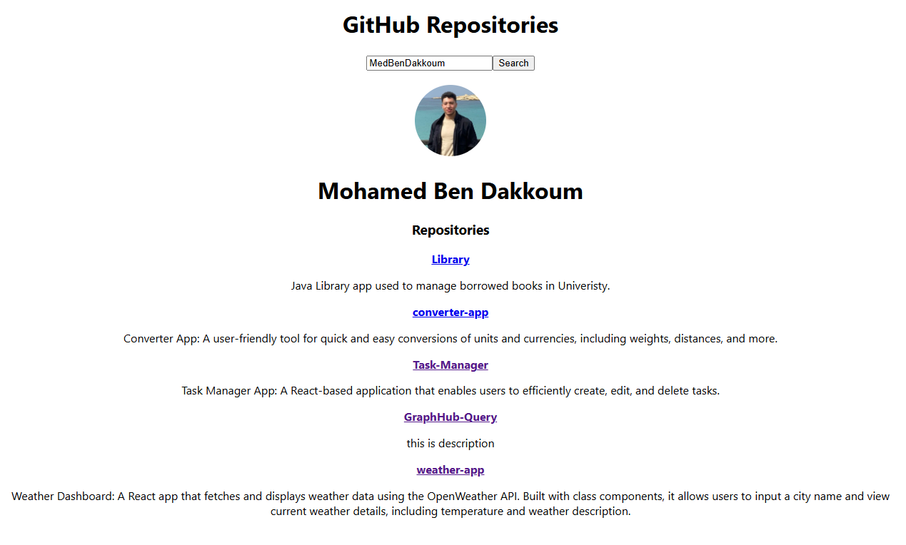

# GraphHub-Query

GraphHub-Query is a React-based application that allows users to retrieve and display GitHub repositories using GitHub's GraphQL API. It provides a simple and efficient way to explore repositories, making it a powerful tool for developers.

## Features

- Fetch and display repositories using GitHub's GraphQL API.
- User-friendly interface for seamless navigation.
- Responsive design for use across various devices.
- Error handling for API calls to ensure smooth user experience.

## Demo

Check out the live demo here: [netlify Demo](https://graph-hub-querry.netlify.app/)

## Screenshot



## Technologies Used

- **React**: Frontend library for building the user interface.
- **GraphQL**: Query language for API data fetching.
- **GitHub API**: Used to retrieve repository data.
- **CSS**: Styling for the application.

## Getting Started

### Prerequisites

Ensure you have the following installed on your system:

- Node.js (>= 14.x)
- npm or yarn
- A valid GitHub token with API access

### Installation

1. Clone the repository:
   ```bash
   git clone https://github.com/MedBenDakkoum/GraphHub-Query.git
   ```
2. Navigate to the project directory:
   ```bash
   cd GraphHub-Query
   ```
3. Install dependencies:
   ```bash
   npm install
   ```

### Setup GitHub Token

1. Generate a personal access token from your GitHub account.
2. Create a `.env` file in the root directory and add your token:
   ```env
   REACT_APP_GITHUB_TOKEN=your_personal_access_token
   ```

### Running the Application

To start the development server, run:

```bash
npm start
```

The app will be available at `http://localhost:3000`.

### Building for Production

To create an optimized production build, run:

```bash
npm run build
```

The production-ready files will be located in the `build` folder.

## Deployment

This project can be easily deployed using platforms like [Netlify](https://www.netlify.com/) or [GitHub Pages](https://pages.github.com/).

### Deploying to Netlify

1. Build the project:
   ```bash
   npm run build
   ```
2. Use the Netlify CLI:
   ```bash
   npm install -g netlify-cli
   netlify login
   netlify init
   netlify deploy --prod
   ```

### Deploying to GitHub Pages

1. Install the GitHub Pages package:
   ```bash
   npm install gh-pages --save-dev
   ```
2. Add the following scripts to your `package.json`:
   ```json
   "homepage": "https://MedBenDakkoum.github.io/GraphHub-Query",
   "scripts": {
     "predeploy": "npm run build",
     "deploy": "gh-pages -d build"
   }
   ```
3. Deploy to GitHub Pages:
   ```bash
   npm run deploy
   ```

## License

This project is licensed under the MIT License. See the [LICENSE](LICENSE) file for details.

## Author

**Mohamed Ben Dakkoum**

Feel free to contribute or report issues!
